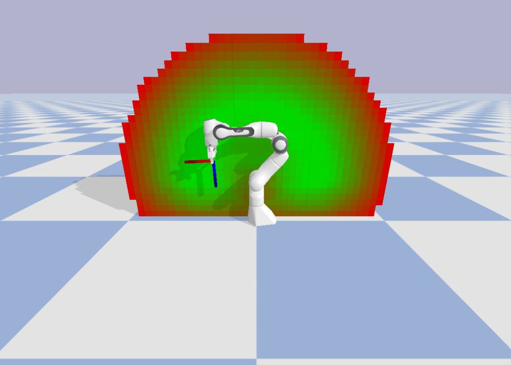
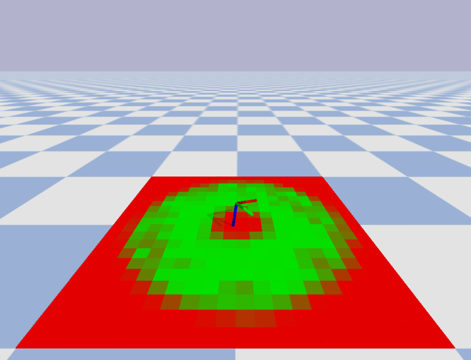

# rm4d

This is the implementation of the paper "RM4D: A Combined Reachability and Inverse Reachability Map for Common 6-/7-axis Robot Arms by Dimensionality Reduction to 4D",
which has been submitted for review to ICRA 2025. 

## Abstract

Knowledge of a manipulator's workspace is fundamental for a variety of tasks including robot design, grasp planning and robot base placement.
Consequently, workspace representations are well studied in robotics.
Two important representations are reachability maps and inverse reachability maps.
The former predicts whether a given end-effector pose is reachable from where the robot currently is, and the latter suggests suitable base positions for a desired end-effector pose.
Typically, the reachability map is built by discretizing the 6D space containing the robot's workspace and determining, for each cell, whether it is reachable or not.
The reachability map is subsequently inverted to build the inverse map.
This is a cumbersome process which restricts the applications of such maps.
In this work, we exploit commonalities of existing six and seven axis robot arms to reduce the dimension of the discretization from 6D to 4D.
We propose Reachability Map 4D (RM4D), a map that only requires a single 4D data structure for both forward and inverse queries.
This gives a much more compact map that can be constructed by an order of magnitude faster than existing maps, with no inversion overheads and no loss in accuracy.
Our experiments showcase the usefulness of RM4D for grasp planning with a mobile manipulator.




## Installation

The `RM4D` package can be installed as follows:

```
git clone git@github.com:mrudorfer/rm4d.git
cd rm4d/
conda env create -n rm4d -f environment.yml
conda activate rm4d
```

This also allows to run all the experiment scripts, except the two scripts for
the base position example:
- `create_base_position_scenario.py`
- `find_base_position_example.py`

To run these, we need to additionally install the [BURG Toolkit](https://mrudorfer.github.io/burg-toolkit/)
for scene/object handling and grasp sampling. This can be done as follows:
```
pip install git+https://github.com/mrudorfer/burg-toolkit@dev
```

## Usage

All experiment scripts are provided in the `experiment_scripts` folder.
The experiment data will be stored in `experiment_scripts/data`.

First, RM4D needs to be constructed by sampling robot configurations:
```commandline
python create_map.py -r franka
```
Per default, we create RM4D with 10M samples and save a checkpoint every 1M samples.

To evaluate accuracy, we need to build a number of evaluation poses:
```commandline
python eval_poses.py -r franka -n 100000
```
This will sample n poses and use IK to determine whether they are reachable or not.
IK number of trials and threshold can be adjusted.
To reproduce the ablation studies for Franka, we can pass the argument `--degrees {150,160,166,180}`,
which will artificially adjust the joint limits of axes 1 and 7.

Subsequently, we can calculate the accuracy of the map:
```commandline
python calculate_accuracy.py data/rm4d_franka_joint_42 data/eval_poses_franka166_n1000000_t25_i100
```
And with `draw_plots.py` we can create the plots as in the paper.
You may need to adjust the paths in the script itself.
